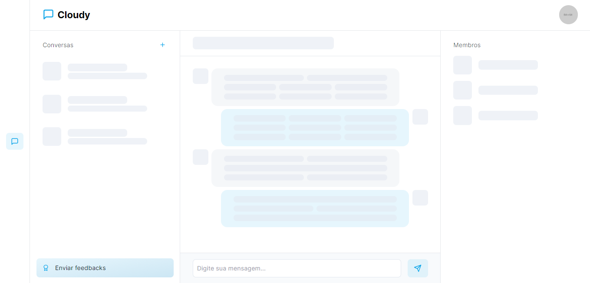

# Cloudy

Um aplicação de mensagens instantâneas em grupo.


<div align="center">
  
  
  
</div>

## 🧪 Tecnologias

As tecnologias utilizadas para desenvolver esta aplicação são:

- [React](https://reactjs.org/)
- [ViteJS](https://vite.co/)
- [TailwindCSS](https://tailwindcss.com/)
- [TypeScript](https://www.typescriptlang.org/)
- [React Router Dom](https://reactrouter.com/docs/en/v6/getting-started/overview)
- [Firebase](https://firebase.google.com/)
- [Git](https://git-scm.com/)
- GitHub Actions

## 📚 Instalação

Passo a passo para rodar a aplicação no seu computador.

1. Clonar repositório:

```bash
$ git clone https://github.com/miguel5g/cloudy.git
$ cd cloudy
```

2. Instalar dependências:

```bash
$ npm install
```

3. Configurar variáveis de ambiente:

```bash
$ copy .env.example .env.local
```

_OBS: Preencher as variáveis de ambiente em `.env.local`._

4. Rodar a aplicação:

```bash
$ npm start:dev
```

<!-- TODO: Add contribution guide -->
